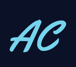

<div id="top"></div>

<!-- PROJECT LOGO -->
<br />
<div align="center">
  <a href="https://github.com/arenclissold/portfolio-react">
    
  </a>

<h3 align="center">Portfolio</h3>

  <p align="center">
    Expressing myself through code and linking to projects, from the past and ones I'm currently working on 👨‍🏭
    <br />
    <a href="https://github.com/arenclissold/portfolio-react"><strong>Explore the docs »</strong></a>
    <br />
    <br />
    <a href="https://github.com/arenclissold/portfolio-react">View Demo</a>
    ·
    <a href="https://github.com/arenclissold/portfolio-react/issues">Report Bug</a>
    ·
    <a href="https://github.com/arenclissold/portfolio-react/issues">Request Feature</a>
  </p>
</div>

<!-- TABLE OF CONTENTS -->
<details>
  <summary>Table of Contents</summary>
  <ol>
    <li>
      <a href="#about-the-project">About The Project</a>
      <ul>
        <li><a href="#built-with">Built With</a></li>
      </ul>
    </li>
    <li>
      <a href="#getting-started">Getting Started</a>
      <ul>
        <li><a href="#prerequisites">Prerequisites</a></li>
        <li><a href="#installation">Installation</a></li>
      </ul>
    </li>
    <li><a href="#usage">Usage</a></li>
    <li><a href="#roadmap">Roadmap</a></li>
    <li><a href="#contributing">Contributing</a></li>
    <li><a href="#license">License</a></li>
    <li><a href="#contact">Contact</a></li>
    <li><a href="#acknowledgments">Acknowledgments</a></li>
  </ol>
</details>

<!-- ABOUT THE PROJECT -->

## About The Project

[![Product Name Screen Shot][product-screenshot]](https://example.com)

Visit the site at: https://arenclissold.com

<p align="right">(<a href="#top">back to top</a>)</p>

### Built With

- [![React][React.js]][React-url]
- [![Typescript][Typescript]][Typescript-url]
- [![Javascript][Javascript]][Javascript-url]
- [![Vite][Vite]][Vite-url]
- [![Tailwind][Tailwind]][Tailwind-url]

<p align="right">(<a href="#top">back to top</a>)</p>

<!-- GETTING STARTED -->

## Getting Started

To get a local copy up and running follow these steps.

### Prerequisites

This is an example of how to list things you need to use the software and how to install them.

- npm
  ```sh
  npm install npm@latest -g
  ```

### Installation

1. Clone the repo
   ```sh
   git clone https://github.com/arenclissold/portfolio-react.git
   ```
2. Install NPM packages
   ```sh
   npm install
   ```
3. Start the local dev server
   ```
   npm run dev
   ```

<p align="right">(<a href="#top">back to top</a>)</p>

<!-- CONTRIBUTING -->

## Contributing

If you have a suggestion that would make this better, please fork the repo and create a pull request. You can also simply open an issue with the tag "enhancement".
Don't forget to give the project a star! Thanks again!

1. Fork the Project
2. Create your Feature Branch (`git checkout -b feature/AmazingFeature`)
3. Commit your Changes (`git commit -m 'Add some AmazingFeature'`)
4. Push to the Branch (`git push origin feature/AmazingFeature`)
5. Open a Pull Request

<p align="right">(<a href="#top">back to top</a>)</p>

<!-- CONTACT -->

## Contact

If you ever want to reach out, I'm always keen for a chat ☕️

[Linkedin]([linkedin-url])

Project Link: [https://github.com/arenclissold/portfolio-react](https://github.com/arenclissold/portfolio-react)

<p align="right">(<a href="#top">back to top</a>)</p>

<!-- ACKNOWLEDGMENTS -->

## Acknowledgments

- [React Icons](https://react-icons.github.io/react-icons/search)
- [Best-README-Template](https://github.com/othneildrew/Best-README-Template)
- [Design Inspiration](https://brittanychiang.com/)
- [Tag Sphere](https://github.com/jjsanmartino03/react-tag-sphere)
- [Canvas Confetti](https://github.com/catdad/canvas-confetti)
- [React Scroll](https://www.npmjs.com/package/react-scroll)
- [EmailJS](https://www.emailjs.com/)
- [Haikei](https://haikei.app/)
- [Hover Effects](https://alvarotrigo.com/blog/best-css-button-hover-effects/)
- [Meta Tags](https://metatags.io/)

<p align="right">(<a href="#top">back to top</a>)</p>

<!-- MARKDOWN LINKS & IMAGES -->
<!-- https://www.markdownguide.org/basic-syntax/#reference-style-links -->

[linkedin-url]: https://linkedin.com/in/arenclissold
[product-screenshot]: public/meta-tag.png
[React.js]: https://img.shields.io/badge/React-20232A?style=for-the-badge&logo=react&logoColor=61DAFB
[React-url]: https://reactjs.org/
[Tailwind]: https://img.shields.io/badge/Tailwind_CSS-38B2AC?style=for-the-badge&logo=tailwind-css&logoColor=white
[Tailwind-url]: https://tailwindcss.com/
[Typescript]: https://img.shields.io/badge/TypeScript-007ACC?style=for-the-badge&logo=typescript&logoColor=white
[Typescript-url]: https://www.typescriptlang.org/
[Javascript]: https://img.shields.io/badge/JavaScript-F7DF1E?style=for-the-badge&logo=javascript&logoColor=black
[Javascript-url]: https://developer.mozilla.org/en-US/docs/Web/JavaScript
[Vite]: https://img.shields.io/badge/Vite-A355fd?style=for-the-badge&logo=vite&logoColor=white
[Vite-url]: https://vitejs.dev/
